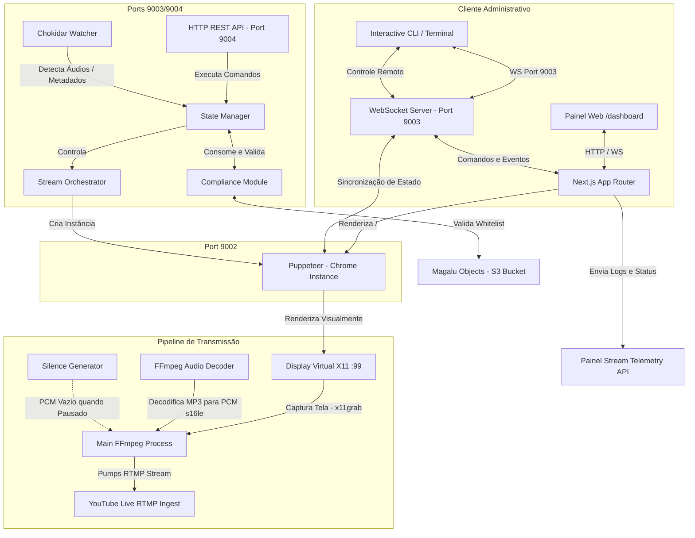

# AuraStream Engine & Dashboard (v2.0)

O **AuraStream v2.0** é um sistema completo e automatizado de transmissão de rádio e vídeo contínuo 24/7 (estilo *lo-fi* / *Abyssal Aurora*). Ele une um backend em **Node.js** de alta performance (para decodificação de áudio, monitoramento de compliance e orquestração de transmissão) a um frontend em **Next.js 15.5** (atuando como tela geradora de vídeo e painel administrativo).

A captação e envio do sinal para o YouTube funcionam de forma "headless" e autocontida no servidor, dispensando o uso de softwares externos de transmissão como o OBS Studio.

---

## 1. Arquitetura Técnica do Sistema

O AuraStream é composto por três blocos principais que se comunicam através de WebSockets e chamadas de API internas:



### 1.1 Fluxo de Funcionamento:
1. **Composição Visual**: O Next.js renderiza a rota principal (`/`) que contém o canvas cinético da Aurora Boreal (`AuroraBackground`) e os overlays de informações da música atual (`MiniPlayer`).
2. **Captação Headless (Virtual Display)**: O backend Node.js inicializa um display virtual via **Xvfb (X11 Virtual Framebuffer)** na VM. Uma instância do **Chromium/Puppeteer** é aberta nesse display apontando para a interface visual.
3. **Pipeline de Transmissão (Ponte Vídeo + Áudio)**:
   - **Vídeo**: O processo principal do **FFmpeg** captura a janela do Chromium usando o codec `-f x11grab` diretamente do display virtual X11, realizando o encoding da imagem para H.264 (`libx264`).
   - **Áudio**: Para economizar memória RAM e processamento na VM (evitando que o browser decodifique áudio pesado e cause descontinuidades no stream), a reprodução de áudio é desativada no browser do Puppeteer (`?stream_client=true`). Em vez disso, o backend gerencia um processo secundário do **FFmpeg (Audio Decoder)** que lê a música MP3 em execução, decodifica-a para PCM raw de 16 bits (`s16le`) a 44.1kHz e injeta o áudio via pipe padrão (`pipe:0`) diretamente no processo principal do FFmpeg.
   - **Output**: O FFmpeg multiplexa o vídeo H.264 e o áudio AAC em um container FLV e envia em tempo real via protocolo RTMP para os servidores do YouTube.

---

## 2. Componentes e Módulos do Servidor (Backend)

Todos os scripts do backend estão localizados sob o diretório `server/`:

### 2.1 Servidor de Comunicação Dual (`server.ts` & `broadcast.ts`)
* **WebSocket Server (`port 9003`)**: Responsável por manter a consistência de estado entre o player de vídeo do Puppeteer, a CLI de comandos e a Dashboard administrativa do Next.js. Toda mudança de faixa, alteração de volume, pausa ou agendamento de desligamento propaga um evento do tipo `server:state_sync`.
* **HTTP REST Server (`port 9004`)**: Criado para resolver problemas de *CORS* e bloqueios de *Mixed Content* de navegadores modernos. Quando a dashboard administrativa é hospedada em HTTPS na nuvem, o browser impede chamadas WebSocket ou HTTP inseguras direta para a VM. O servidor expõe endpoints GET `/api/state` e POST `/api/command` que são consumidos pelo Proxy do Painel.

### 2.2 Orquestrador de Stream (`stream.ts`)
* **Gerador de Silêncio (`Silence Generator`)**: Caso o áudio seja pausado pelo usuário, o FFmpeg de saída fecharia a conexão com o YouTube devido à falta de dados no input de áudio. Para evitar isso, um gerador emite dados PCM em branco (17.640 bytes a cada 100ms) mantendo a taxa de transferência ativa.
* **Auto-Reconexão com Backoff Exponencial**: Caso haja um drop na rede ou perda de conexão com o YouTube RTMP, o orquestrador detecta a finalização do processo do FFmpeg e executa tentativas automáticas de reinicialização da transmissão (até 5 tentativas) utilizando backoff exponencial ($2^n$ segundos).

### 2.3 Monitor de Compliance (`compliance.ts`)
* **Validador de Direitos Autorais**: Antes de avançar para uma faixa de áudio na queue, o motor de compliance lê o arquivo local de controle de canais `src/assets/details/songs.json`. Se a faixa não estiver listada como aprovada pela whitelist, ela é classificada como `REJECTED` e o sistema realiza um *auto-skip* para a próxima música válida da lista.
* **Audit Logger**: Logs de conformidade técnica são anexados automaticamente no arquivo local `logs/compliance-audit.jsonl`.

### 2.4 Watcher de Diretórios (`watcher.ts`)
* Utiliza a biblioteca **Chokidar** para monitorar adições ou remoções de arquivos `.mp3` no diretório `src/assets/audio/`. Adições integram novas músicas na fila de reprodução dinamicamente e deleções limpam a fila instantaneamente.

### 2.5 CLI Interativa (`cli.ts` & `cli-ws.ts`)
* Console administrativo interativo baseado na biblioteca **Inquirer**. Conecta-se via WebSocket na porta `9003` permitindo monitorar o status do stream, avançar faixas, alterar o volume de saída do áudio em tempo real, checar logs de conformidade e programar temporizadores de auto-shutdown.

---

## 3. Estrutura do Diretório

Abaixo está descrita a estrutura técnica do repositório:

```text
project/
├── .github/                   # Workflows do GitHub Actions
├── _bmad/                     # Componentes internos de orquestração do BMad Framework
├── _bmad-output/              # Relatórios de testes e planejamento do BMad
├── docs/                      # Blueprints visuais e documentação complementar do rádio
├── logs/                      # Pasta de armazenamento dos logs de conformidade e auditoria
├── server/                    # Backend Node.js em TypeScript (Mecanismo de Transmissão e API)
│   ├── server.ts              # Arquivo de entrada principal (Inicializa APIs REST 9004 e WS 9003)
│   ├── stream.ts              # Pipeline Puppeteer + FFmpeg (Captura de tela, decodificação e RTMP)
│   ├── queue.ts               # Gerenciador da Fila de reprodução de músicas
│   ├── compliance.ts          # Validador de Whitelist (NCS Compliance) e gerador de logs
│   ├── watcher.ts             # Monitoramento de modificações no disco (Chokidar)
│   ├── shutdown-timer.ts      # Mecanismo do temporizador de encerramento (Sleep Timer)
│   ├── shutdown-sequence.ts   # Desligamento seguro das portas, browser e processos FFmpeg
│   ├── cli.ts                 # Código principal do CLI Inquirer
│   ├── cli-ws.ts              # Conector WebSocket para o CLI
│   ├── state.ts               # Estado persistido em cache JSON
│   ├── broadcast.ts           # Auxiliares de transmissão WebSocket
│   └── types.ts               # Definições de tipos de dados do Servidor
├── src/                       # Aplicação Frontend Next.js (Visual da Transmissão e Dashboard)
│   ├── app/
│   │   ├── page.tsx           # Player visual renderizado pelo Puppeteer para captura de vídeo
│   │   ├── dashboard/         # Dashboard administrativa completa
│   │   └── api/               # API do frontend
│   │       └── audio/         # Serve os arquivos MP3 locais via streaming HTTP
│   ├── components/
│   │   ├── streaming/         # Componentes específicos (AuroraBackground, NowPlaying, Fila, etc.)
│   │   └── ui/                # Componentes genéricos de UI baseados em Radix / Shadcn
│   ├── hooks/
│   │   ├── use-audio-engine.ts # Sequenciador Web Audio com Crossfading (para escuta local)
│   │   └── use-websocket.ts   # Conexão de sincronização de estado em tempo real
│   ├── assets/                # Pasta de armazenamento de músicas e banco de metadados
│   │   ├── audio/             # Arquivos de áudio (.mp3) locais
│   │   └── details/           # Banco songs.json e arquivos markdown
│   └── lib/                   # Auxiliares de estilização e geração de placeholders
├── autostart.sh               # Script automatizado executado pelo tmux no boot do sistema
├── install-vm-deps.sh         # Script de instalação de dependências e firewall no Ubuntu
├── start-dev.sh               # Script de inicialização em modo Desenvolvimento
├── start-build.sh             # Script de compilação e inicialização em modo Produção
├── tailwind.config.ts         # Configuração do design system do Tailwind CSS
├── tsconfig.json              # Configuração geral de compilação TypeScript
├── tsconfig.server.json       # Configuração de TypeScript específica para rodar a pasta server/
└── yarn.lock                  # Lockfile de dependências do Yarn
```

---

## 4. Referência de Comunicação (WebSocket e HTTP)

### 4.1 Mensagens WebSocket (Porta `9003`)

#### Eventos Enviados pelo Servidor (`Server -> Client`)
* **`server:state_sync`**: Sincroniza o estado atual completo da rádio (fila de reprodução, música atual tocando, status da stream, contagem regressiva de encerramento).
  ```json
  {
    "event": "server:state_sync",
    "payload": {
      "status": "streaming",
      "currentTrack": {
        "id": "song-id",
        "filename": "musica.mp3",
        "path": "/caminho/musica.mp3",
        "metadata": { "title": "...", "artist": "..." }
      },
      "queue": [ ... ],
      "shutdownCountdown": 300
    }
  }
  ```
* **`server:compliance_skip`**: Informa que a música atual foi pulada por não passar nas regras de compliance de direitos autorais.
* **`server:error`**: Informa falhas no processamento de comandos (ex: `stream_key_missing`, `decode_failed`).

#### Eventos Enviados pelo Cliente (`Client -> Server`)
* **`media:play`**: Inicia o áudio local/stream.
* **`media:pause`**: Pausa a reprodução ativa e ativa o gerador de silêncio de segurança do FFmpeg.
* **`media:skip`**: Avança para a próxima música em compliance.
* **`media:previous`**: Retorna para a música válida anterior.
* **`media:volume`**: Define o volume do decoder (de `0.0` a `2.0`). Payload: `number`.
* **`media:start_stream`**: Inicializa o Puppeteer e o processo principal do FFmpeg direcionando ao YouTube Live.
* **`media:stop_stream`**: Para os processos do FFmpeg e desliga a instância do Chromium de forma segura.
* **`queue:reorder`**: Reordena a fila de reprodução. Payload: `{ "newOrder": ["id-1", "id-2", ...] }`.
* **`timer:set_shutdown`**: Agenda um desligamento automático. Payload: `string` (Preset: `"30m"`, `"1h"`, `"2h"`, `"4h"`).
* **`timer:cancel`**: Cancela temporizadores ativos de desligamento.

---

### 4.2 API REST (Porta `9004`)

#### `GET /api/state`
Obtém o estado atual e dados de fila de forma idêntica ao WebSocket sync (mas sem revelar o token `streamKey`).
* **Resposta (200 OK)**: JSON de estado.

#### `POST /api/command`
Permite enviar comandos via HTTP POST a partir do painel administrativo.
* **Corpo da Requisição**:
  ```json
  {
    "event": "media:skip",
    "payload": {}
  }
  ```
* **Resposta (200 OK)**: Estado atualizado após processamento do evento.

---

## 5. Variáveis de Ambiente (`.env`)

Crie um arquivo `.env` na raiz do diretório `project/` com as seguintes credenciais:

```ini
# Chave de transmissão padrão do YouTube (usada se o painel não fornecer uma temporária)
YOUTUBE_STREAM_KEY="xxxx-xxxx-xxxx-xxxx-xxxx"

# Identificação do canal de rádio sendo transmitido
ACTIVE_CHANNEL="dark-fantasy"

# Credenciais e endpoint do Magalu Objects para validação de compliance
MGC_ENDPOINT="https://br-se1.magaluobjects.com"
MGC_BUCKET_NAME="nome-do-bucket-de-mídias"

# Envio de telemetria das VMs para o painel administrativo
TELEMETRY_ENDPOINT="http://localhost:3000/api/admin/telemetry"
INTERNAL_API_KEY="chave-secreta-de-comunicacao-m2m"
```

---

## 6. Configuração, Instalação e Execução

### 6.1 Instalação e Configuração Automática na VM
Se estiver instalando em uma máquina virtual Linux Ubuntu zerada, execute o script de provisionamento automático que prepara o ambiente Xvfb, instala pacotes necessários, abre o firewall e configura o TMUX:
```bash
chmod +x install-vm-deps.sh
./install-vm-deps.sh
```

### 6.2 Execução em Ambiente de Desenvolvimento
Roda o servidor WebSocket e o frontend Next.js simultaneamente em modo hot-reload:
```bash
./start-dev.sh
```

### 6.3 Execução em Ambiente de Produção (Build Otimizado)
Gera o build estático do Next.js e inicia os processos otimizados do backend e frontend de produção:
```bash
./start-build.sh
```
* **Painel Administrativo**: [http://localhost:9002/dashboard](http://localhost:9002/dashboard)
* **Tela de Visualização (Stream View)**: [http://localhost:9002/](http://localhost:9002/)

### 6.4 Inicialização Manual do CLI
Para abrir o controle do terminal via linha de comando:
```bash
npm run cli
```

---

## 7. Peculiaridades de Design e Implementação

1. **Desativação de Áudio no Browser (`?stream_client=true`)**: Conforme mencionado no fluxo de funcionamento, o browser Puppeteer é aberto com a flag `stream_client=true`. Isso desliga a Web Audio API na visualização captada por Puppeteer, pois a decodificação de áudio no Chrome Headless consome muita memória RAM ao longo do tempo e causaria estouros de cache na VM. O áudio do stream é decodificado via FFmpeg direto da VM, obtendo estabilidade perfeita.
2. **Resolução de Captura Dinâmica**: O script de transmissão utiliza `xdpyinfo` para ler as dimensões reais da tela virtual do Xvfb. Se o display estiver rodando em uma resolução menor (ex: 1280x1024), o FFmpeg ajusta automaticamente a captura e faz o *upscaling* para 1920x1080 via filtro de escala de vídeo antes de enviar para o YouTube, evitando distorções visuais ou cortes pretos nas bordas da live stream.
3. **Crossfading em Escuta Local**: O frontend Next.js utiliza um hook customizado `useAudioEngine.ts` baseado em **Web Audio API** que realiza crossfades de 500ms entre as faixas quando o usuário ouve a rádio diretamente pela aba do navegador, garantindo uma transição suave idêntica à transmissão principal.
